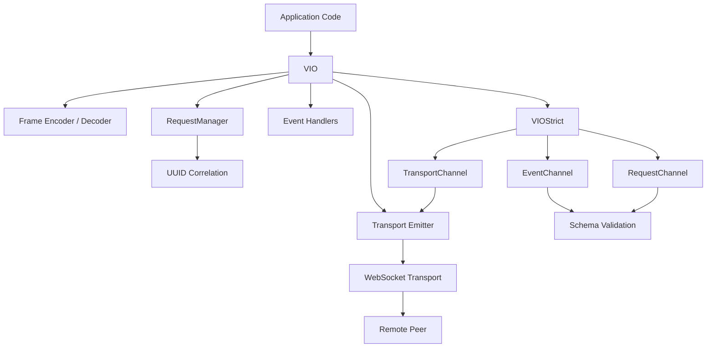
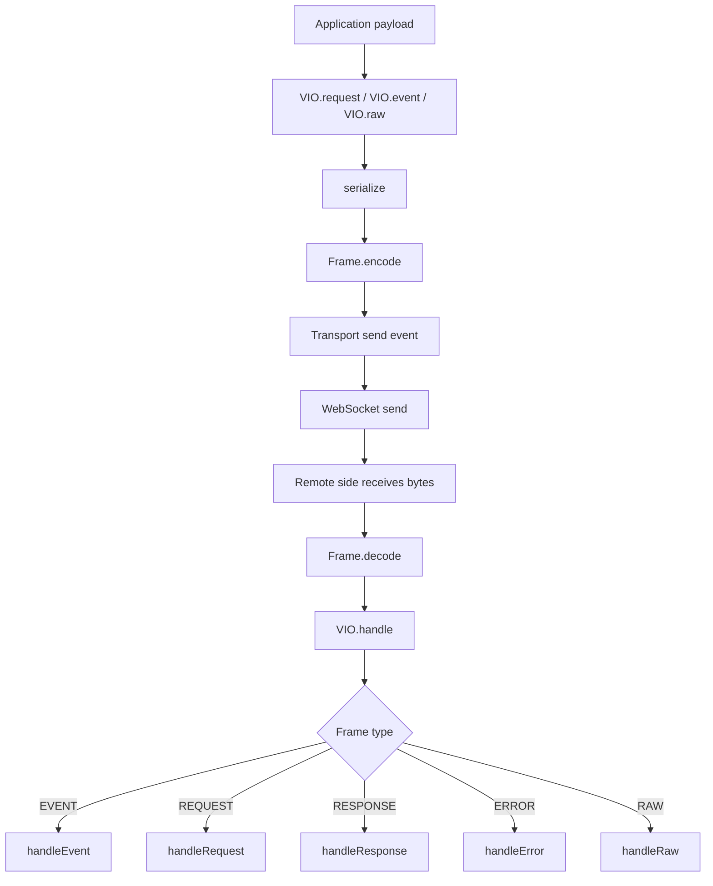
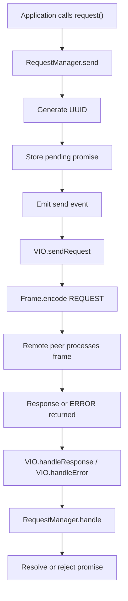
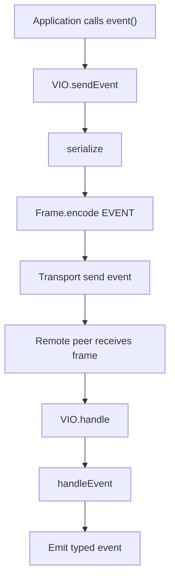
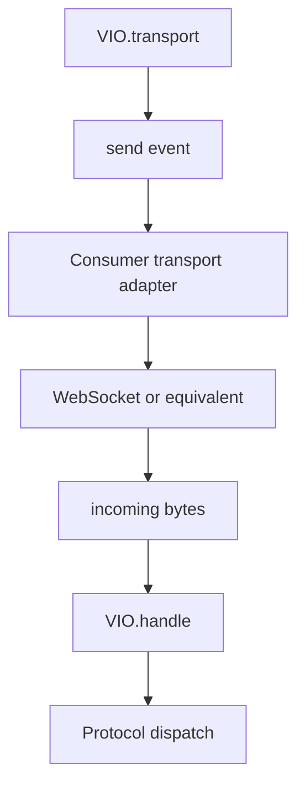
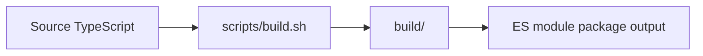

# Vortez IO Architecture Guide

This document explains how Vortez IO works internally, how protocol frames move through the runtime end to end, and how the public API layers fit together.

## Who This Is For

- Engineers evaluating Vortez IO for WebSocket-based messaging.
- Teams integrating request/response correlation or event delivery.
- Contributors who need to understand the runtime boundaries and extension points.

## System At A Glance

## Runtime Layers

Vortez IO is intentionally split into a small set of layers:

- `Frame` owns binary protocol encoding and decoding.
- `VIO` owns transport-facing behavior and dispatches incoming frames.
- `RequestManager` tracks pending requests, UUID correlation, and timeouts.
- `VIOStrict` wraps `VIO` with typed channels and schema validation.
- Support modules provide UTF-8, varint, UUID, and line-based codecs.

This keeps binary protocol concerns isolated from typed application concerns.

## Frame Lifecycle

### Key behavior

- `Frame` always expects the protocol header to be present.
- `REQUEST` and `RESPONSE` frames use UUID identifiers.
- `EVENT` frames use string identifiers.
- `ERROR` frames can be protocol-level (`NONE`) or request-bound (`UUID`).
- `RAW` frames are passed through without higher-level interpretation.

## Request Lifecycle

### Key behavior

- Request correlation is handled entirely by UUID.
- Timeouts are enforced in `RequestManager`.
- A response is only considered valid if it reaches the pending UUID entry.
- If the remote side returns an `ERROR`, the pending request is rejected with a `VIOError`.

## Event Lifecycle

### Key behavior

- Event payloads are serialized according to their runtime shape.
- JSON payloads are decoded with UTF-8 and `JSON.parse`.
- LINE payloads use the line codec.
- Binary and custom payloads are passed as `Uint8Array`.

## Strict Layer

`VIOStrict` is the typed integration layer for applications that want schemas and named channels.

- `event` validates outbound event payloads and inbound event payloads.
- `request` validates outbound request payloads and inbound response payloads.
- `transport` bridges raw byte transport and re-emits low-level transport events.

The strict layer does not replace `VIO`; it composes it.

## Transport Model

### Key behavior

- The runtime stays transport-agnostic.
- Consumers decide how frames are written to the socket or stream.
- The library only emits encoded bytes and processes incoming bytes.

## Data Modes

Vortez IO supports four frame modes:

- `BINARY` for raw `Uint8Array` / `ArrayBuffer` payloads.
- `JSON` for structured object payloads.
- `LINE` for key-value style line payloads.
- `CUSTOM` for application-defined binary semantics.

Mode selection is handled by `VIO.serialize` and by the decoding branches in `VIO.handleEvent`, `VIO.handleRequest`, `VIO.handleResponse`, and `VIO.handleError`.

## Error Handling

Errors are treated as protocol data and runtime signals.

- `VIOError` is used for protocol validation and runtime failures.
- Decoding failures become `INVALID_DATA` or related protocol errors.
- Unknown types or modes are surfaced as protocol errors.
- Transport emission failures are re-emitted through the transport error channel with context.

### Key behavior

- If a request-bound error can be matched to a UUID, it is routed back through `RequestManager`.
- If an error frame has no UUID, it is emitted as a general runtime error.
- Invalid frames are rejected early to keep state predictable.

## Public API Map

- `VIO`: transport-aware runtime for requests, events, raw frames, and frame handling.
- `Frame`: low-level protocol encoder and decoder.
- `RequestManager`: pending request bookkeeping and timeout management.
- `VIOStrict`: typed wrapper over `VIO` with schema-validated channels.
- `VIOError`: protocol and runtime error type.

## Build And Distribution

The published package targets an ES module environment and ships compiled output from the `build/` directory.

## Recommended Documentation Map

To keep the documentation aligned with the codebase, split the docs by intent:

- README: short overview, install, and quick start.
- PROTOCOL.md: binary frame specification and wire-level rules.
- ARCHITECTURE.md: runtime layers and message flow.
- API reference: exported classes, methods, and types.
- Examples: minimal WebSocket integration and strict typed usage.

This architecture guide is the canonical high-level reference for how Vortez IO is structured.
